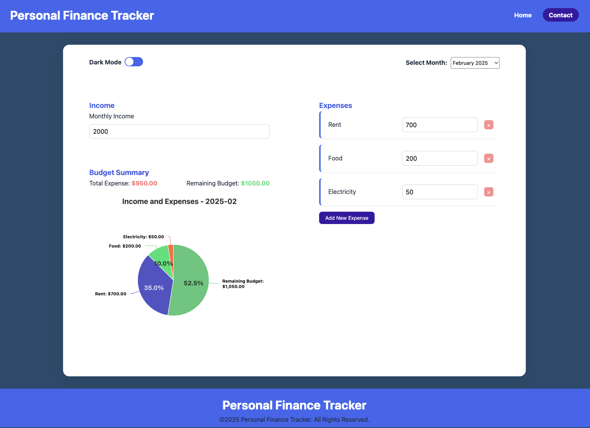

# README

## About This Project

This project was created as the final project for Tamwood's Course 3. It is a Personal Finance Tracker that focuses on saving data to storage using JavaScript and creating charts with the Highcharts library.

## Technologies Used

-  HTML5
-  CSS
-  Javascript
-  Highcharts

## How to View This Site

1. Clone the repository:
   ```bash
   git clone https://github.com/Ayumu1995/Personal-Finance-Tracker
   ```
2. Navigate to the directory:
   ```bash
   cd Personal-Finance-Tracker
   ```
3. Open the `index.html` file in your browser.

## Directory Structure

```
FinalProject
├── README.md
├── example.png
├── index.html
├── page
│   └── contact.html
├── script.js
└── style.css
```

## Author

Ayumu Miyamoto, Igor Vieira Guedes Oliveira, Daniel Attoni

## Libraries Used

This project utilizes the Highcharts library for creating interactive charts and graphs.

## Sample Screenshot

Below is a sample screenshot of the site when opened in a browser:


